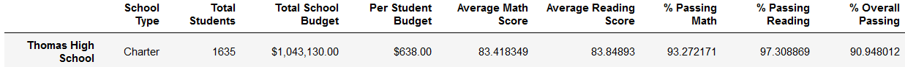
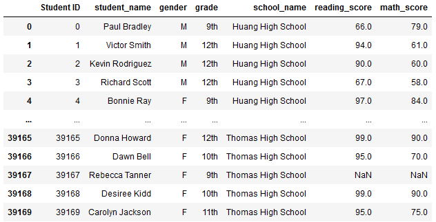
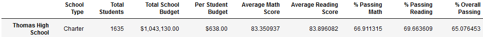
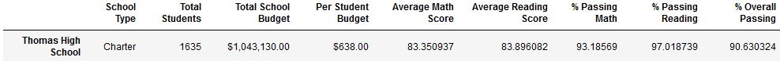
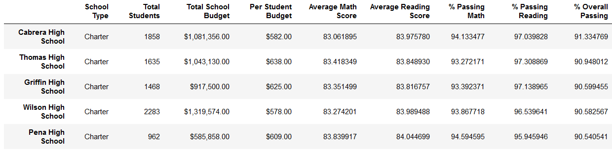
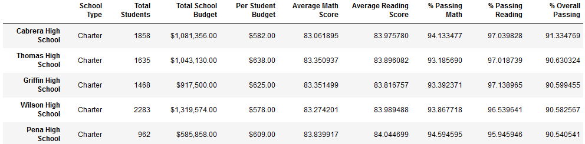

# School_District_Analysis
## Overview
The school board has determined that there was a problem with some of the test schools from Thomas High School. Maria would like to understand the impact this has on the original school district summary.

## Purpose
The purpose of this analysis is to gage the impact of the scores for the ninth grade students at Thomas High School. This will be done by removing the scores for all ninth graders at Thomas High School, repeating the district calculations and comparing the outcomes.

## Analysis

### Starting Point
To understand any changes we must first consider the orignal analysis. Here is the original summary for Thomas High School:

### Updating the Thomas High School ninth grade scores
Now that we know our starting point, let's address the Ninth grade scores at Thomas High School. To do this we will replace all of the Ninth grade scores with NaN, so their values no longer effect Thomas High Schools score averages and percentages. To do this we will employ the np.nan function from the numpy library.

#### Replace Thomas High School ninth grade scores with NaN
We can see that we've done this correctly when we look at the student data output and see the ninth grade scores for Thomas High School students now report as NaN.

Having replaced the ninth grade scores with NaN, we can compare the updated Thoms High School summary to the original summary.

Original Thomas High School summary:

Updated summary after replacing ninth grade scores:

Since changing the scores doesn't change the number of students, first five columns are identical. When we get to the scores we can see the impact.
    - Average Math Score has drop slightly
    - Average Reading Score has gone up slightly
    - % Passing Math, Reading and Overall have all dropped significantly

The current updated summary no longer has the scores for the ninth grade students, effectively setting their scores to zero, which is significantly skewing the percentages.

#### Normalizing the Thomas High School scores
We must account for the lack of scores for the Thomas High School ninth grade students, by not considering them when calculating the Thomas High School score averages and percentages.

Now we can compare the resulting Thomas High School summary to the original.

Original Thomas High School summary:

Normalized Thomas High School summary:

The Average Math Score is still slightly lower and the Average Reading Score is still slightly higher, but now:
    - % Passing Math is slightly lower
    - % Passing Reading is also slightly lower
    - leading to an % Overall Passing this is slightly lower

### Impact on Top Schools list
Thomas High School was originally second on the list of top schools as illustrated below.

Looking at the updated Top School list we see that Thomas has a slightly lower % Overall Passing score, but not low enough to move them from their position on the list, as illustrated below.

